# AGRI-SCAN AI | BÁC SĨ CÂY TRỒNG THÔNG MINH

> **Dự án tham gia:** Website & AI Innovation Contest 2026

> **Hạng mục:** Bảng A - Foundation Track

> **Trạng thái:** Đang phát triển

<p align="center">
<a href="https://www.google.com/search?q=LICENSE">

</a>


</p>

## Quick Links
* **Website:** [agri-scan-ai](https://agriscan.duckdns.org/) 
* **Source Code:** [GitHub](https://github.com/MITOM06/AGRI-SCAN-AI-ASA-)
* **Dataset:** [Rice Leaf Diseases Detection - Kaggle](https://www.kaggle.com/datasets/loki4514/rice-leaf-diseases-detection)
* **Dữ liệu đã chia (Train/Val/Test):** [Google Drive](https://drive.google.com/drive/folders/1Ebmeq0fpYecxsK6QEL-sqtjTGGQbUFB6?usp=sharing)

## Mục lục 
* [I. Tổng quan dự án (Project Overview)](#i-tổng-quan-dự-án-project-overview)
* [II. Tính năng của sản phẩm](#ii-tính-năng-của-sản-phẩm)
* [III. Giải pháp AI (AI Solutions)](#iii-giải-pháp-ai-ai-solutions)
* [IV. Kiến trúc hệ thống & Công nghệ](#iv-kiến-trúc-hệ-thống--công-nghệ)
* [V. Hạn chế hiện tại và định hướng phát triển](#v-hạn-chế-hiện-tại-và-định-hướng-phát-triển)
* [VI. Hướng dẫn cài đặt](#vi-hướng-dẫn-cài-đặt-update-later)
* [VII. Project Management & OSS](#vii-project-management--oss-update-later)
* [VIII. Thiết kế cơ sở dữ liệu](#viii-thiết-kế-cơ-sở-dữ-liệu)

## I. TỔNG QUAN DỰ ÁN (PROJECT OVERVIEW)

### 1.1. Giới thiệu dự án
**Agri-Scan AI** là hệ thống đa nền tảng (Web & Mobile App) ứng dụng trí tuệ nhân tạo nhằm hỗ trợ nông dân và người yêu cây cảnh trong việc quản lý sức khỏe cây trồng. Hệ thống đóng vai trò như một "trợ lý nông nghiệp ảo", giúp chẩn đoán bệnh nhanh chóng và đưa ra giải pháp chăm sóc khoa học.

### 1.2. Bối cảnh & Vấn đề (The Problem)
Hiện nay, ngành nông nghiệp đang đối mặt với nhiều thách thức:
* **Nhận diện sai lệch:** Nông dân thường nhầm lẫn giữa các loại bệnh có triệu chứng giống nhau, dẫn đến dùng sai thuốc, gây lãng phí và ô nhiễm.
* **Tiếp cận thông tin chậm:** Việc chờ đợi chuyên gia xuống thực địa mất nhiều thời gian, khiến dịch bệnh lây lan nhanh.
* **Thiếu lộ trình chăm sóc:** Người trồng cây đô thị (Home-farming) thường thiếu kiến thức về quy trình bón phân, tưới nước đúng cách.

### 1.3. Giải pháp (The Solution)
Hệ thống Agri-Scan AI cung cấp bộ giải pháp toàn diện:
1. **AI Diagnosis:** Nhận diện bệnh cây qua ảnh chụp tức thời với độ chính xác cao.
2. **Smart Treatment:** Đưa ra phác đồ điều trị chi tiết (nguyên nhân, cách xử lý, loại phân bón/thuốc khuyến nghị).
3. **Care Roadmap:** Xây dựng lộ trình chăm sóc định kỳ cho từng giai đoạn phát triển của cây.
4. **Community Knowledge:** Thư viện mở về các kỹ thuật canh tác nông nghiệp bền vững.

### 1.4. Giá trị cốt lõi (Core Values)
* **Chính xác:** Tận dụng sức mạnh của các mô hình Computer Vision tiên tiến.
* **Kịp thời:** Chẩn đoán ngay tại đồng ruộng chỉ với một chiếc smartphone.
* **Bền vững:** Ưu tiên các giải pháp sinh học và quy trình chăm sóc thân thiện môi trường.

### 1.5 Thành viên nhóm

<table align="center">
  <tr>
    <td align="center" valign="top" width="160px">
      <a href="https://github.com/tapu25z">
        <br />
        <div style="height: 8px;"></div>
        <sub><b>Bùi Huỳnh Tây</b></sub>
      </a><br />
      <div style="height: 5px;"></div>
      <sub style="display: block; min-height: 30px; line-height: 1.2;"><b>Leader / AI Architect</b></sub>
    </td>
    <td align="center" valign="top" width="160px">
      <a href="https://github.com/thanhnhanqn77">
        <br />
        <div style="height: 8px;"></div>
        <sub><b>Hà Lê Thành Nhân</b></sub>
      </a><br />
      <div style="height: 5px;"></div>
      <sub style="display: block; min-height: 30px; line-height: 1.2;"><b>AI Engineer</b></sub>
    </td>
    <td align="center" valign="top" width="160px">
      <a href="https://github.com/MITOM06">
        <br />
        <div style="height: 8px;"></div>
        <sub><b>Trần Phúc Khang</b></sub>
      </a><br />
      <div style="height: 5px;"></div>
      <sub style="display: block; min-height: 30px; line-height: 1.2;"><b>Backend & DevOps</b></sub>
    </td>
    <td align="center" valign="top" width="160px">
      <a href="https://github.com/BangSonChau">
        <br />
        <div style="height: 8px;"></div>
        <sub><b>Châu Băng Sơn</b></sub>
      </a><br />
      <div style="height: 5px;"></div>
      <sub style="display: block; min-height: 30px; line-height: 1.2;"><b>Web Developer</b></sub>
    </td>
    <td align="center" valign="top" width="160px">
      <a href="https://github.com/Tung-pro123">
        <br />
        <div style="height: 8px;"></div>
        <sub><b>Lê Thanh Tùng</b></sub>
      </a><br />
      <div style="height: 5px;"></div>
      <sub style="display: block; min-height: 30px; line-height: 1.2;"><b>Mobile Developer</b></sub>
    </td>
  </tr>
</table>

| Thành viên | Vai trò | Trách nhiệm chính | University |
| :--- | :--- | :--- | :--- |
| **Bùi Huỳnh Tây** | **Team Leader & AI Architect** | Quản lý dự án, Data Engineering, thiết kế kiến trúc AI, triển khai LLM. | Trường ĐH CNTT - ĐHQG-HCM |
| **Hà Lê Thành Nhân** | **AI Engineer** | Nghiên cứu & huấn luyện Computer Vision Model (ViT + MoE), tiền xử lý Dataset. | Đại học FPT |
| **Trần Phúc Khang** | **Backend & DevOps** | Phát triển Core API (NestJS), thiết kế Database (MongoDB), đóng gói Docker & CI/CD. | FPT Aptech |
| **Châu Băng Sơn** | **UI/UX & Web Dev** | Thiết kế giao diện Figma, phát triển Dashboard Admin & Landing Page (React/NextJS). | Đại học FPT |
| **Lê Thanh Tùng** | **Mobile App Dev** | Phát triển ứng dụng Mobile (React Native), xử lý Camera AI & đồng bộ hóa dữ liệu. | Đại học FPT |

## II. Tính năng của sản phẩm

Để đảm bảo tiến độ cuộc thi và tập trung vào tính năng cốt lõi có ứng dụng AI (tiêu chí ăn điểm nhất), phiên bản MVP (Minimum Viable Product) của Agri-Scan AI sẽ được giới hạn nghiêm ngặt như sau:

### 2.1. Tính năng cốt lõi BẮT BUỘC HOÀN THIỆN:
#### 2.1.1. **Chatbot AI:**
   * Người dùng tải lên hoặc chụp trực tiếp ảnh lá cây/thân cây bị bệnh.
   * Hệ thống xử lý ảnh và trả về kết quả: Tên bệnh, Độ tin cậy (%).
   * Lưu lại các phiên chẩn đoán và lịch sử chat với AI để người dùng theo dõi tiến triển của cây.

<p align="center">
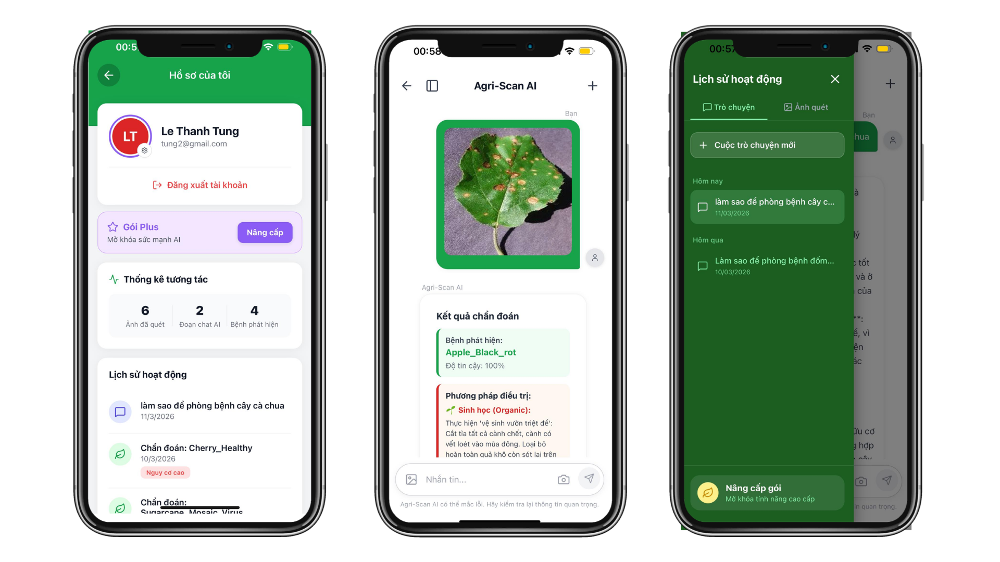
</p>

#### 2.1.2. **Plant Wiki:**
* Dữ liệu chuyên sâu: Cung cấp thông tin chi tiết về đặc điểm sinh học, môi trường sống, và các bệnh lý đặc trưng của loài cây trồng tại Việt Nam.
* Bộ lọc thông minh: Cho phép người dùng phân loại nhanh theo: Loại cây (Cây ăn quả, cây công nghiệp, cây cảnh...), Tốc độ sinh trưởng, và Nhu cầu ánh sáng/nước.
* Thông tin bệnh lý tích hợp: Mỗi loài cây đi kèm với danh sách các loại nấm, vi khuẩn và sâu bệnh thường gặp, giúp người dùng có cái nhìn tổng quan trước khi canh tác.

<p align="center">
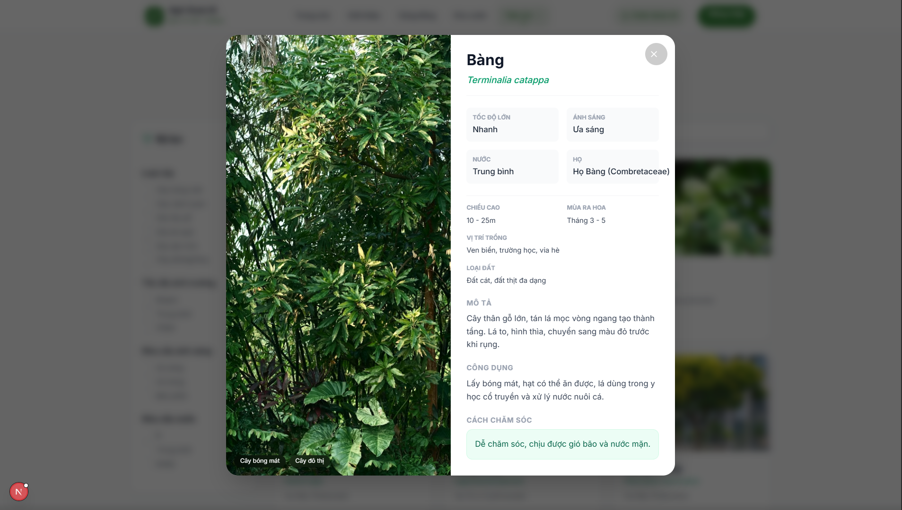
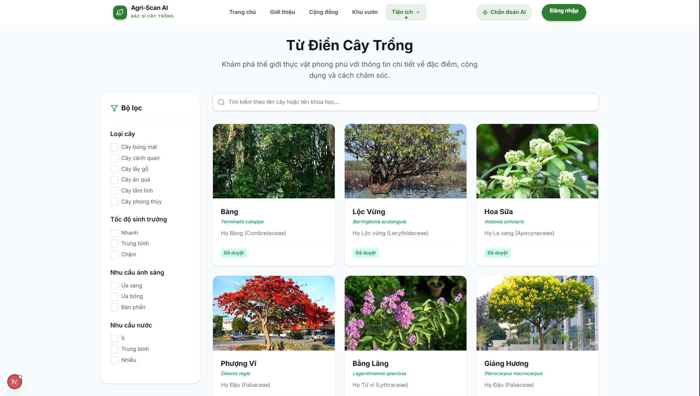
</p>

#### 2.1.3. **Vườn của tôi:**
- Dashboard theo dõi sinh trưởng: Hiển thị lộ trình phát triển của cây qua từng giai đoạn (Cây non -> Phát triển -> Ra hoa -> Đậu quả -> Thu hoạch).
- Phân tích chỉ số lý tưởng: Cung cấp thông tin về Độ ẩm đất, Ánh sáng, Dinh dưỡng và Tỷ lệ đậu quả phù hợp nhất cho từng loại cây cụ thể đang trồng.
- Chẩn đoán & Giải pháp (Smart Diagnosis):
   * Tự động hiển thị chi tiết loại bệnh vừa nhận diện từ AI Chatbot.
   * Đề xuất Bí quyết chăm sóc chuyên sâu: Ví dụ như siết nước, bón phân Kali cao, hay kỹ thuật thụ phấn nhân tạo để tăng năng suất.
   * Gợi ý lộ trình phục hồi cây bị bệnh theo từng bước (Step-by-step).
<p align="center">
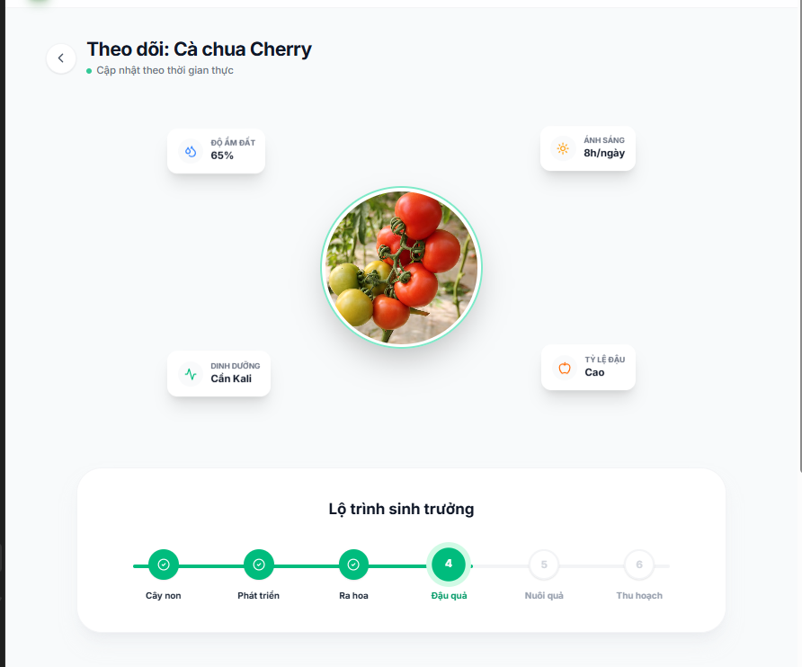
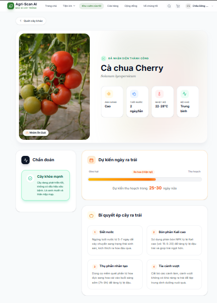
</p>

#### 2.1.4. **Thời tiết:**
* Cảnh báo rủi ro (Risk Alert): Tự động đưa ra cảnh báo về Sốc nhiệt hoặc biến động nhiệt độ ngày đêm lớn (>15°C), giúp người nông dân chủ động phòng tránh tình trạng cây bị stress.
* Dự báo chi tiết 24h & 8 ngày: Hiển thị nhiệt độ, độ ẩm, tốc độ gió và chỉ số UV theo thời gian thực tại vị trí người dùng.
* Bác sĩ cây trồng khuyến nghị: Dựa trên thời tiết (ví dụ: độ ẩm cao), hệ thống sẽ đưa ra lời khuyên canh tác phù hợp như: "Hạn chế bón phân hữu cơ trong thời tiết nồm ẩm để tránh nấm bệnh".
<p align="center">
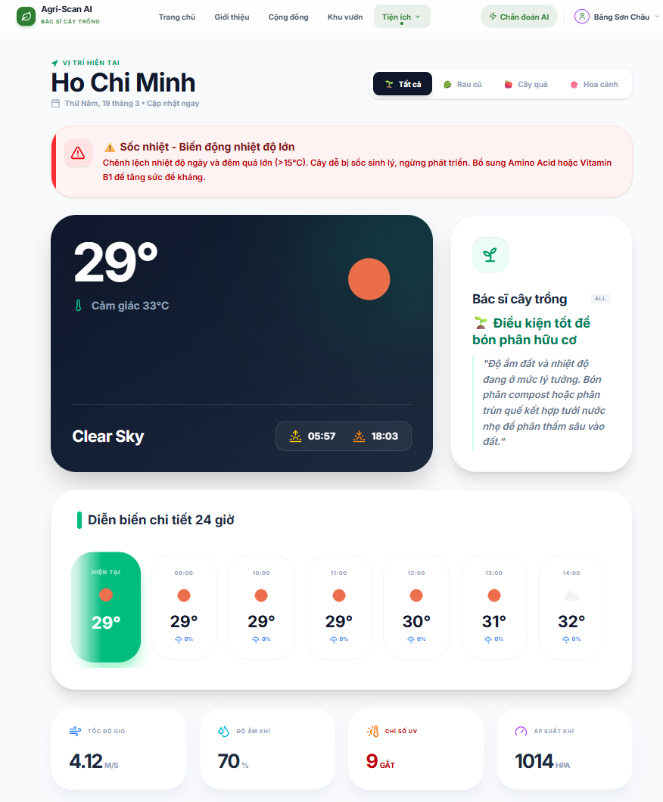
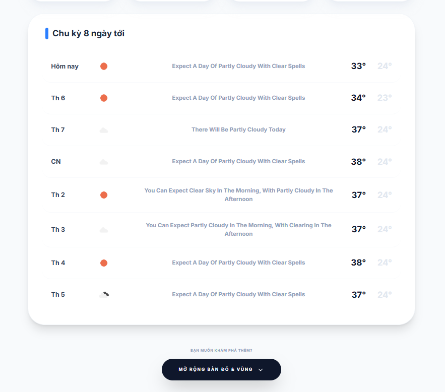
</p>

### 2.2. Các tính năng KHÔNG LÀM trong giai đoạn này (Out of Scope):
* *Sàn thương mại điện tử:* Không tích hợp chức năng mua bán vật tư nông nghiệp/thuốc trừ sâu.
* *Cộng đồng/Mạng xã hội:* Chưa làm tính năng đăng bài, bình luận, chia sẻ phức tạp.
*(Lý do: Tập trung toàn lực vào độ mượt mà của hệ thống AI và trải nghiệm UI/UX).*

### 2.3 Giá trị khác biệt (Cập nhật sau)

---

## III. GIẢI PHÁP AI (AI SOLUTIONS)

Hệ thống ứng dụng những kỹ thuật tiên tiến trong lĩnh vực Học máy (Machine Learning) và Xử lý ngôn ngữ tự nhiên (NLP) để tạo ra một "Bác sĩ cây trồng" kỹ thuật số có độ chính xác vượt trội.

### 3.1. Kiến trúc cốt lõi (Core Backbone)
Agri-Scan AI xây dựng trên nền tảng mạng nơ-ron sâu hiện đại kết hợp giữa **Vision Transformer (ViT)** và cơ chế **Mixture of Experts (MoE)**.
* **Transformer Encoder:** Thực hiện chia cắt hình ảnh thành các "patch", giúp mô hình hiểu được ngữ cảnh không gian và mối liên hệ giữa các vùng bị bệnh trên lá lúa.
* **Mixture of Experts (MoE):** Sử dụng mạng Gating thông minh để điều hướng dữ liệu đến các "Expert" chuyên biệt, giúp phân biệt chính xác các loại bệnh có triệu chứng tương đồng.
* **Regularization:** Áp dụng các kỹ thuật Orthogonal, Entropy và Usage Regularization nhằm tối ưu hóa hiệu suất và tính đa dạng của các Expert.

### 3.2. Dữ liệu huấn luyện 
Mô hình được huấn luyện trên tập dữ liệu hình ảnh thực tế từ [rice-leaf-diseases-detection](https://www.kaggle.com/datasets/loki4514/rice-leaf-diseases-detection), bao gồm lá lúa khỏe mạnh và các loại bệnh hại phổ biến nhất. Hệ thống có khả năng phân loại chính xác **9 lớp (classes)** sau:


| STT | Tên bệnh | Class Name | Hình ảnh mẫu | Train | Val | Test | Đặc điểm nhận dạng |
| :--: | :--- | :--- | :---: | :---: | :---: | :---: | :--- |
| 1 | **Bạc lá** | Bacterial Leaf Blight | 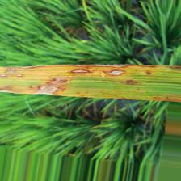 | 957 | 119 | 121 | Các vết sọc dài vàng nhạt/trắng dọc rìa lá |
| 2 | **Tiêm lửa** | Brown Spot | 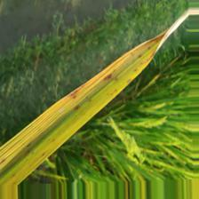 | 1229 | 153 | 155 | Các đốm tròn/bầu dục nâu nhỏ rải rác |
| 3 | **Đạo ôn lá** | Leaf Blast | 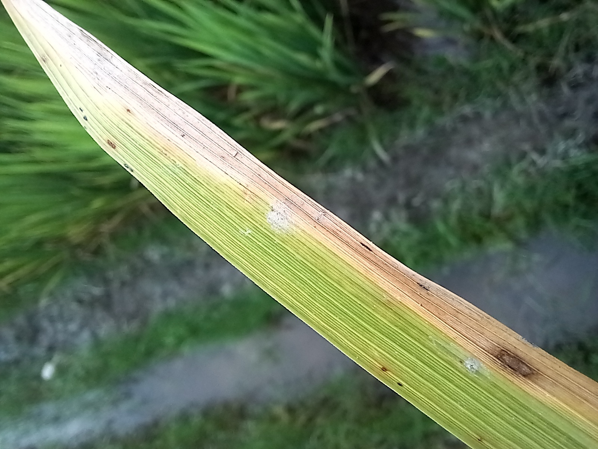 | 1370 | 171 | 172 | Vết hình thoi, tâm xám trắng, viền nâu đậm |
| 4 | **Cháy lá** | Leaf Scald | 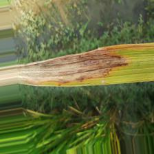 | 1065 | 133 | 134 | Vết cháy loang lổ từ chóp lá, vân gợn sóng |
| 5 | **Đốm nâu hẹp** | Narrow Brown | 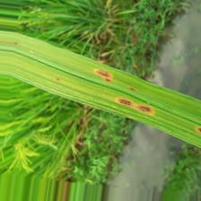 | 763 | 95 | 96 | Vết đốm nâu hẹp, dài mảnh song song gân lá |
| 6 | **Đạo ôn cổ bông**| Neck Blast | 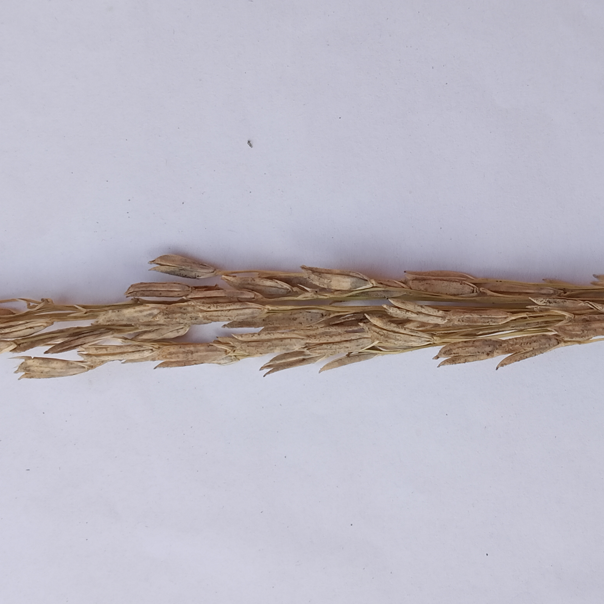 | 800 | 100 | 100 | Thắt cổ bông, làm hạt lép hoặc gãy gục |
| 7 | **Bọ gai** | Rice Hispa | 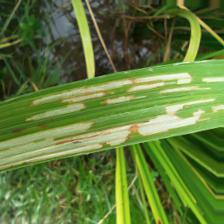 | 1039 | 129 | 131 | Vết trắng dài do sâu ăn tạo đường rãnh |
| 8 | **Khô vằn** | Sheath Blight | 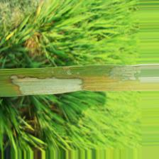 | 1300 | 162 | 163 | Vết đốm vằn da hổ ở bẹ lá sát mặt nước |
| 9 | **Lá khỏe mạnh** | Healthy Rice Leaf | 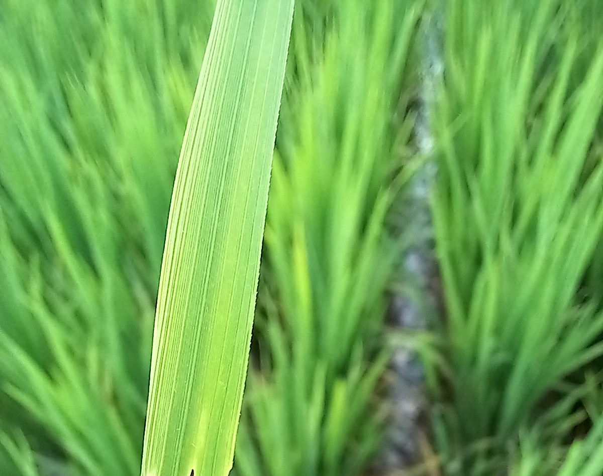 | 865 | 108 | 109 | Lá xanh mướt, không có dấu hiệu tổn thương |
| | **TỔNG CỘNG** | | | **9,388** | **1,170** | **1,181** | **Tổng cộng: 11,739 file** |

### 3.3. Các Endpoints API chính
Dự án cung cấp 3 dịch vụ API độc lập, đảm bảo khả năng mở rộng và tích hợp linh hoạt:

#### 3.3.1. Vision Model - Phân loại bệnh (`/predict`)
* **Chức năng:** Chẩn đoán tình trạng bệnh lý qua hình ảnh.
* **Công nghệ:** ViT + MoE Backbone.
* **Input/Output:** Nhận file ảnh (jpg, png) và trả về nhãn bệnh kèm độ tự tin (Confidence score).

#### 3.3.2. LLM Model - Trợ lý kỹ thuật (`/chat`)
* **Chức năng:** Tư vấn kỹ thuật canh tác và chăm sóc cây trồng.
* **Công nghệ:** LLM (gemini-3-flash-preview) kết hợp với kỹ thuật **RAG (Retrieval-Augmented Generation)**.
* **Đặc điểm:** Truy xuất dữ liệu từ cơ sở tri thức nông nghiệp tin cậy, giúp chatbot đưa ra câu trả lời chính xác và hạn chế tối đa hiện tượng "ảo giác" (hallucination) của AI.

#### 3.3.3. Giải pháp My Garden (`/my_garden`)
* **Chức năng:** Cung cấp phác đồ điều trị chi tiết sau khi chẩn đoán.
* **Output:** Hướng dẫn sử dụng thuốc BVTV, điều chỉnh phân bón và quy trình tưới nước cụ thể cho từng loại bệnh.

### 3.4. Kiến trúc hệ thống AI 
Quy trình xử lý dữ liệu được thiết kế khép kín nhằm tối ưu hóa trải nghiệm người dùng:
1.  **Tiền xử lý:** Hình ảnh đầu vào được Resize, Normalization và Augmentation (trong quá trình train) để tăng độ bền vững cho mô hình.
2.  **Inference:** ViT-MoE trích xuất đặc trưng và đưa ra kết quả phân loại.
3.  **Tối ưu hóa phản hồi:** Kết quả chẩn đoán được đưa vào hệ thống RAG để LLM (Llama-2-70B) tạo ra lộ trình chăm sóc cá nhân hóa (Personalized Calendar).

<p align="center">
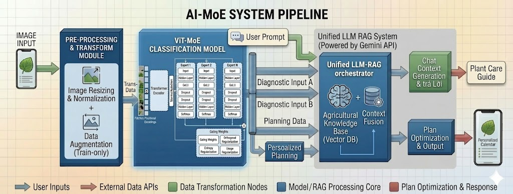
</p>

### 3.5. Kết quả thực nghiệm 
Dựa trên báo cáo kiểm thử, mô hình đạt được hiệu suất cực kỳ ấn tượng với **Độ chính xác tổng thể (Overall Accuracy) đạt 99.49%**.

| Tên lớp bệnh | Độ chính xác (%) | Số mẫu kiểm thử |
| :--- | :--- | :--- |
| **Bacterial Leaf Blight** | 97.52% | 118/121 |
| **Brown Spot** | 100.00% | 155/155 |
| **Healthy Rice Leaf** | 100.00% | 109/109 |
| **Leaf Blast** | 98.26% | 169/172 |
| **Leaf Scald** | 100.00% | 134/134 |
| **Neck Blast** | 100.00% | 100/100 |
| **Rice Hispa** | 100.00% | 131/131 |
| **Sheath Blight** | 100.00% | 163/163 |

Data đã được chia thành 3 tập train/val/test: tại [data_splited](https://drive.google.com/drive/folders/1Ebmeq0fpYecxsK6QEL-sqtjTGGQbUFB6?usp=sharing)

---

## IV. KIẾN TRÚC HỆ THỐNG & CÔNG NGHỆ 

### 4.1 Công nghệ sử dụng
Dự án áp dụng kiến trúc **Monolithic (Nguyên khối)** để tối ưu thời gian phát triển, dễ dàng đóng gói, nhưng vẫn giữ cấu trúc code phân mô-đun (Modular) rõ ràng để dễ bảo trì. Toàn bộ hệ thống sử dụng ngôn ngữ **TypeScript** nhằm đảm bảo tính đồng nhất.

#### 4.1.1 Hệ thống Backend
* **Framework:** **NestJS (Node.js).** * *Lý do:* Cấu trúc chặt chẽ, dễ dàng phân chia các module trong cùng một khối Monolithic. Xử lý tốt việc nhận file ảnh từ client, gọi AI APIs bên thứ ba, phân tích kết quả và trả về.
* **Cơ sở dữ liệu (Database):** **MongoDB.**
  * *Lý do:* Cơ sở dữ liệu NoSQL cực kỳ linh hoạt để lưu trữ các tài liệu. Thông tin về đặc điểm sinh học, triệu chứng bệnh rất đa dạng, dùng MongoDB dễ mở rộng trường dữ liệu hơn SQL.
* **Bộ nhớ đệm (Caching):** **Redis.**
  * *Lý do:* Tăng tốc độ phản hồi và tiết kiệm chi phí gọi AI API. Các yêu cầu quét bệnh phổ biến sẽ được cache lại để trả về ngay lập tức.

#### 4.1.2. Hệ thống Frontend 
* **Mobile App (iOS & Android):** **React Native (với Expo).**
  * *Lý do:* Code một lần, build ra cả ứng dụng iOS và Android. Tốc độ làm UI nhanh, dễ dàng tích hợp Camera để chụp ảnh lá cây.
* **Web Interface:** **React (Vite) hoặc Next.js.**
  * *Lý do:* Dùng chung hệ sinh thái React với Mobile App, tái sử dụng logic/component. Làm Landing Page và trang Admin quản lý dữ liệu.

#### 4.1.3. Hạ tầng & Triển khai 
* **Đóng gói (Containerization):** **Docker & Docker Compose.**
  * Toàn bộ backend, MongoDB và Redis được đóng gói. Dựng môi trường nhanh chóng chỉ với `docker-compose up -d`.
* **Triển khai Cloud (Hosting):**
  * Backend & Database: Deploy lên Google Cloud Platform (GCP).
  * Web Frontend: Deploy qua Vercel hoặc Firebase Hosting.

### 4.2 Kiến trúc hệ thống
---


## V. Hạn chế hiện tại và định hướng phát triển

### 5.1 Hạn chế
### 5.2 Định hướng phát triển


---
## VI. Hướng dẫn cài đặt (Update Later)
---

## VII. Project Management & OSS (Update Later)
---

## VIII. THIẾT KẾ CƠ SỞ DỮ LIỆU

Dự án sử dụng **MongoDB**, áp dụng nguyên tắc thiết kế NoSQL: Hạn chế join phức tạp, ưu tiên tốc độ đọc. Hệ thống quản lý chặt chẽ hạn mức sử dụng của người dùng (Rate Limiting cho AI Scan & Prompt).

### 8.1. Collection: `users`
Lưu trữ thông tin người dùng, phân quyền và quản lý gói cước dịch vụ.

```typescript
export declare class User {
    email: string;
    password: string;
    fullName: string;
    role: string;
    plan: string;
    planExpiresAt: Date | null;
    dailyImageCount: number;
    dailyPromptCount: number;
    lastResetDate: Date;
}
```

### 8.2. Collection: `plants`
Khớp với dữ liệu phân loại thực vật học, lưu trữ thông số sinh trưởng chi tiết.

```typescript
export declare class Plant {
    commonName: string;
    scientificName: string;
    family: string;
    description: string;
    images: string[];
    uses: string;
    care: string;
    category: string[];
    growthRate: string;
    light: string;
    water: string;
    height: string;
    floweringTime: string;
    suitableLocation: string;
    soil: string;
    status: string;
    diseases: Disease[];
}
```

### 8.3. Collection: `diseases`
Từ điển bệnh lý chi tiết, nguyên nhân và phác đồ điều trị đa phương pháp.

```typescript
export declare class Disease {
    name: string;
    pathogen: string;
    type: string;
    symptoms: string[];
    treatments: Treatment;
    status: string;
}
```

### 8.4. Collection: `scan_histories` & `chat_histories`
Lưu vết quá trình tương tác của người dùng với hệ thống AI để theo dõi sự cải thiện của cây trồng.

```typescript
// Lịch sử nhận diện bệnh qua ảnh
declare class AIPrediction {
    diseaseId: Disease;
    confidence: number;
}

export declare class ScanHistory {
    userId: User;
    imageUrl: string;
    aiPredictions: AIPrediction[];
    isAccurate: boolean | null;
    scannedAt: Date;
}

// Lịch sử tư vấn với trợ lý AI
export interface IChatMessage {
    role: 'user' | 'ai';
    content: string;
    timestamp: Date;
}

export declare class ChatHistory {
    userId: Types.ObjectId | User;
    title: string;
    messages: IChatMessage[];
}
```

---
